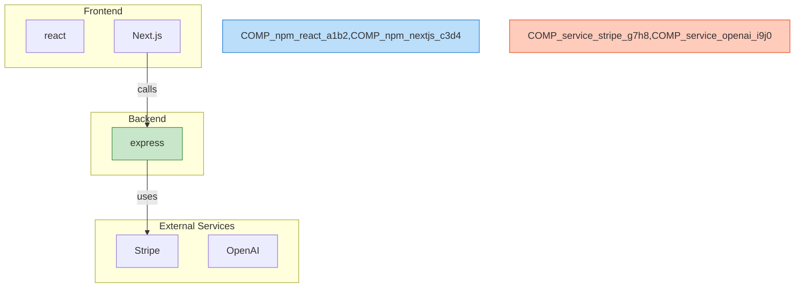

# NavGator Diagram Generator

Generate visual architecture diagrams in Mermaid format.

## When to Use

- Visualize the overall architecture before making changes
- Generate documentation diagrams
- Understand component relationships at a glance
- Create focused diagrams around specific components

## Usage

### Full Architecture Diagram

```bash
npx @tyroneross/navgator diagram
```

Generates a complete architecture diagram with all components grouped by layer (frontend, backend, database, queue, infrastructure, external).

### Component-Focused Diagram

```bash
npx @tyroneross/navgator diagram --focus "Stripe"
```

Generates a diagram centered on a specific component, showing its direct connections.

### Layer Diagram

```bash
npx @tyroneross/navgator diagram --layer backend
```

Shows only components in a specific layer and their connections to other layers.

### Summary Diagram

```bash
npx @tyroneross/navgator diagram --summary
```

Shows only the most-connected components for a simplified overview.

## Options

| Option | Description |
|--------|-------------|
| `--focus <name>` | Center diagram on a specific component |
| `--layer <name>` | Show only a specific layer (frontend, backend, database, queue, infra, external) |
| `--summary` | Show only top connected components |
| `--direction <dir>` | Diagram direction: TB, BT, LR, RL (default: TB) |
| `--no-styles` | Disable color styling |
| `--no-labels` | Hide connection labels |
| `--output <file>` | Save to file instead of stdout |
| `--max-nodes <n>` | Maximum nodes to show (default: 50) |

## Output Format

The diagram is output as Mermaid markdown that can be:
- Pasted into GitHub/GitLab markdown files
- Rendered in VS Code with Mermaid extensions
- Used in documentation tools like Docusaurus, MkDocs
- Converted to images using mermaid-cli

## Example Output



## Tips

1. **Run scan first**: Diagrams are generated from the stored architecture data. Run `/nav-scan` first if you haven't already.

2. **Use focus for complex projects**: Large codebases may have too many nodes. Use `--focus` to see specific areas.

3. **Export for documentation**: Use `--output architecture.md` to save directly to your docs folder.

4. **Combine with impact analysis**: After running `/nav-impact <component>`, generate a focused diagram to visualize the affected components.
